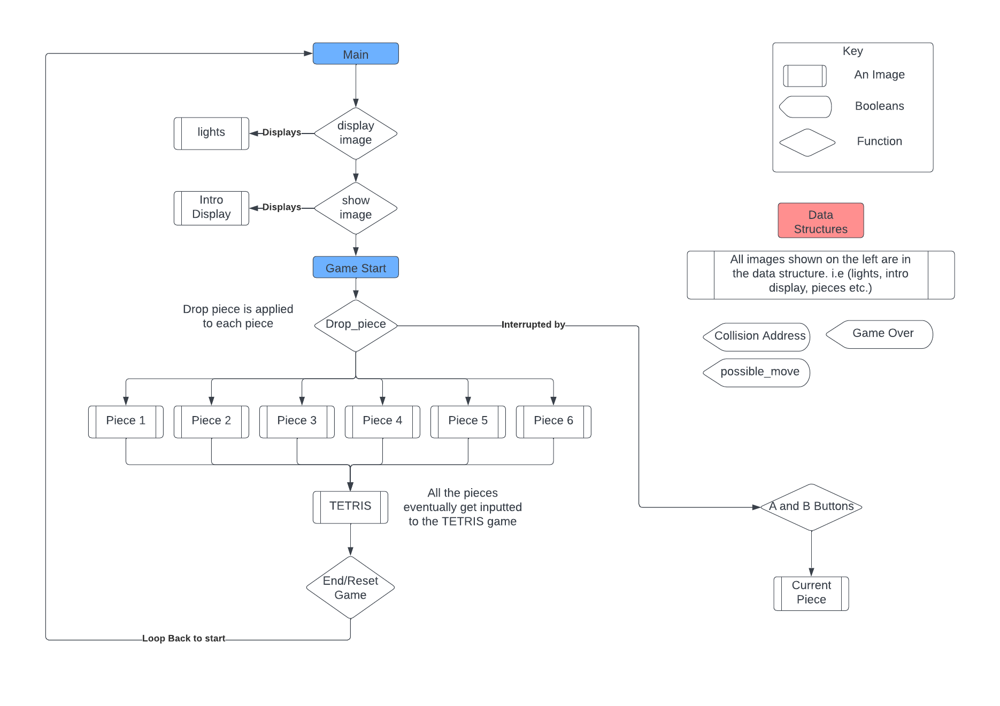

# Mini Tetris

Mini tetris is an interactive game created on a 5x5 LED display of a microbit. The game runs 3 stages. The initial display of the TETRIS word and a brief light show, the play of the game, and lastly the end/reset stage. The following report describes how the game is played, how the game was implemented, and an analysis on the final design.

The play of the game involves placing 6 pieces on the board. Only one piece is placed at a time and each piece is inserted into the game at the top of the display. The player is able to control the position of the pieces by using the A button to left shift and the B button to right shift.  The pieces will automatically move downwards and players will have a limited time to conduct their shifts. The game ends when all six pieces are placed, or if there is no space at the top of the board for a piece to be inserted.

At the end of the game the board will flash three times and the values of the game will be reset. A loop will keep the game endlessly re-running.

Note: The A and B buttons must be timed on the descent of the piece in order for a shift to happen. Explanation of this is discussed in the analysis section of the report.

<h2>Implementation</h2>

The game utilises a series of functions and data structures to make the implementation of the design clean and easily modifiable. The figure below provides a diagram of how the main functions of the game work together to display the correct images.

When the game starts, the drop piece function is called on the first piece. This function is in charge of inserting, descending and setting a piece. The function starts by copying the values of this piece to the 'current_piece' data structure of the game. Creating this copy allows changes to be made to the piece's position and only having to reset/overwrite this copy as the game moves along.

 Afterwards, it checks if inserting the piece into the game is valid by calling the 'check_collision' function on the piece. A collision returns true if ANDing the values of TETRIS data and the values of the piece data returns a value greater than 0. If a piece insertion is invalid, the game_over boolean is set to true and the game ends. If it is valid, the piece is inserted and starts descending to the bottom.

 A single piece's data consists of the three main aspects. The column values of the piece, the size of the piece (vertically and horizontally) and the position of the piece. The vertical size is what dictates how many times a piece is able to descend, the horizontal size dictages how far a piece can shift left to right. 

There are two key functions used to display an image on the board, Display_image and Show_image. Show_image displays a still image on the board for a given time. It starts by turning on the row pins for each value in data. It then turns on the corresponding column for that row, delays for a while, turns the column off, and then delays again before repeating the loop. This scans the image and allows us to display any sort of image we want on the 5x5 board.

display_image uses a loop to show a moving version of an image going from left to right. This function follows the same logic as the show_image function but instead of looping through individual columns it loops through sections of a full image. It does this by utilising the show_image function to show parts of a display, extending the sections after each loop. Together, these two functions are used to display the states of the game as it moves along.

